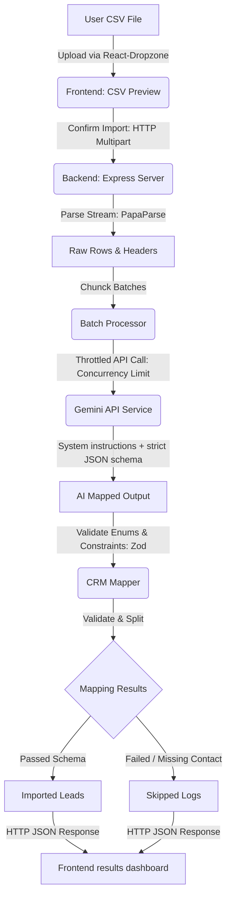

# GrowEasy CRM - AI-Powered CSV Importer

An intelligent, production-grade CSV Importer application that allows users to upload any CSV structure, dynamically maps and extracts lead information using Google Gemini 2.5 Flash, validates inputs using Zod, and reports results in a custom-designed "Midnight Emerald" dashboard.

---

## 🏗️ Architecture Overview

The codebase is split into a **Next.js Frontend Client** and an **Express.js Backend Service**.



### Key Technical Characteristics

*   **No Hardcoded Mappings**: Dynamic LLM prompt instructions enable the parser to infer columns from arbitrary spreadsheets (Facebook Leads, Google Ads exports, manual formats, etc.).
*   **Controlled Concurrency Throttling**: Batching blocks of records concurrently through Gemini API calls to avoid rate limiting and timeouts.
*   **Exponential Backoff Retries**: Failed mapping attempts automatically trigger a backoff wait time to ensure robustness against api-throttles.
*   **Strict Zod Validations**: Guarantees output type matching, cleans formats (dates/phones), enforces enum boundaries (`GOOD_LEAD_FOLLOW_UP`), and filters records missing both email and mobile numbers.
*   **Theme Integration**: A unified design token system delivering "Midnight Emerald" light and dark modes natively (Tailwind CSS v4).

---

## ⚙️ Environment Variables

### Backend Server (`backend/.env`)

Create a `.env` file in the `backend/` directory:

```env
# Application Port
PORT=5000

# Server Environment
NODE_ENV=development

# Allowed Cross-Origin Site
CORS_ORIGIN=http://localhost:3000

# Google Gemini API Key (Required for mapping)
GEMINI_API_KEY=your_google_gemini_api_key_here

# (Optional) Configurable Gemini Model Name
GEMINI_MODEL=gemini-2.5-flash

# (Optional) Concurrency & Batch Settings
IMPORT_BATCH_SIZE=50
IMPORT_CONCURRENCY=2
IMPORT_MAX_RETRIES=3
```

---

## 🚀 Running Locally

Ensure Node.js 22 LTS or higher is installed.

### 1. Initialize & Start Backend Server

```bash
cd backend
npm install
# Add your GEMINI_API_KEY to backend/.env
npm run dev
```
The server will start on `http://localhost:5000` with the `/health` endpoint accessible.

### 2. Initialize & Start Frontend Dashboard

```bash
cd frontend
npm install
npm run dev
```
Open `http://localhost:3000` to access the dashboard.

---

## 💾 Deployment Guidance

### Frontend (Vercel)
1. Commit and push the code to a Git repository.
2. Link the repository to Vercel.
3. Configure the Root Directory to `frontend`.
4. Add the Environment Variable `NEXT_PUBLIC_API_URL` pointing to your deployed backend URL.

### Backend (Render)
1. Deploy as a Web Service.
2. Configure the Root Directory to `backend`.
3. Set the build command to `npm run build` and start command to `npm run start`.
4. Configure all environment variables listed above (especially `GEMINI_API_KEY`).

---

## 🔮 Future Improvements

1.  **Server-Sent Events (SSE)**: Implement real-time progress update streams to indicate precise progress percentage counts for massive (e.g. 50,000 rows) CSV files.
2.  **Interactive Schema Customization**: Allow users to review mapping confidence scores and tweak mappings manually in the preview table before final execution.
3.  **Database Integration**: Connect final mappings to a relational database (e.g. PostgreSQL) or external GrowEasy REST endpoints.
